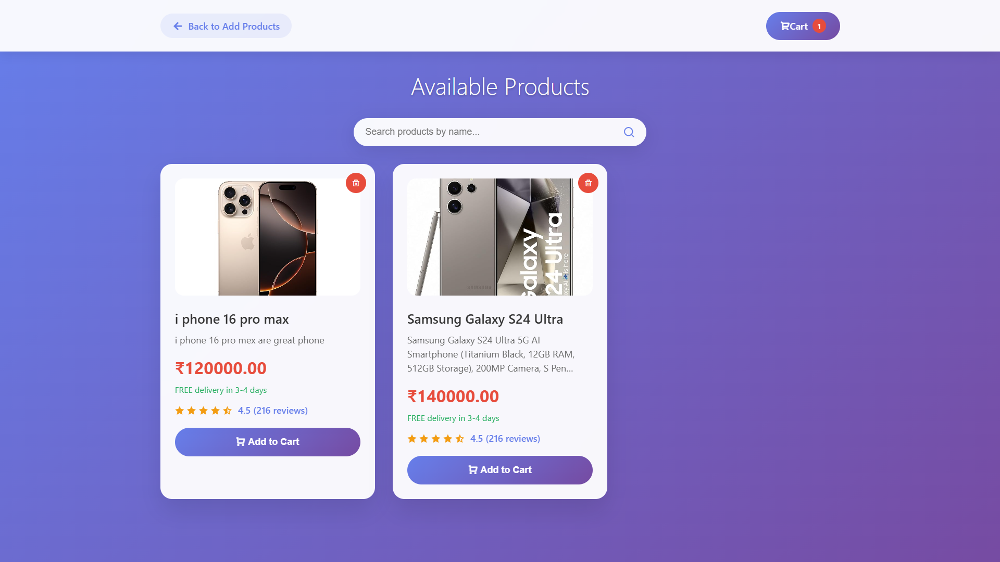
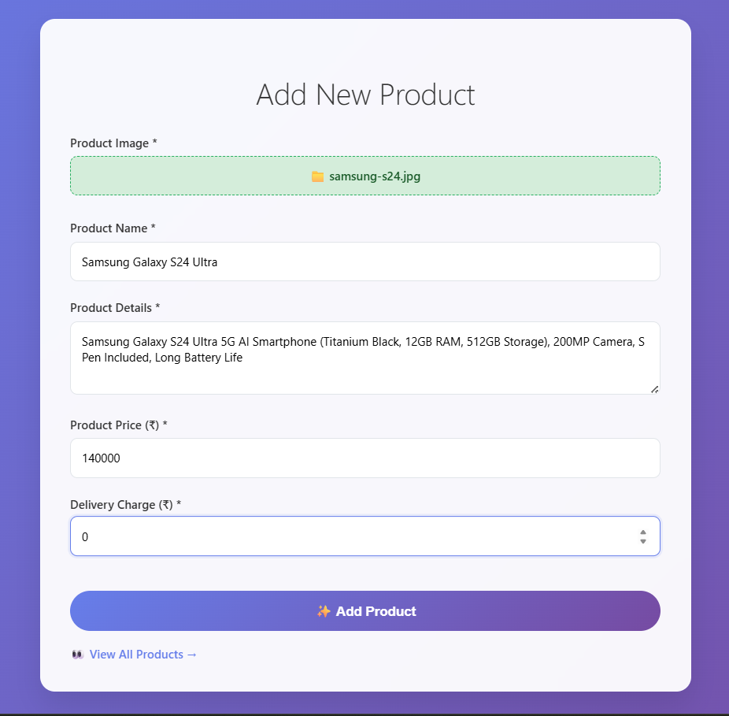
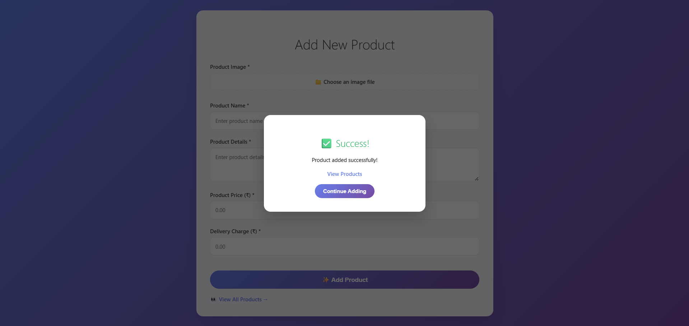
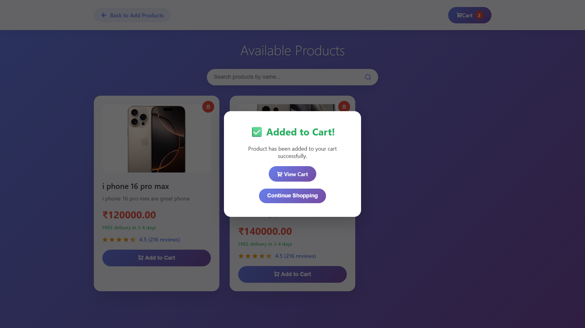
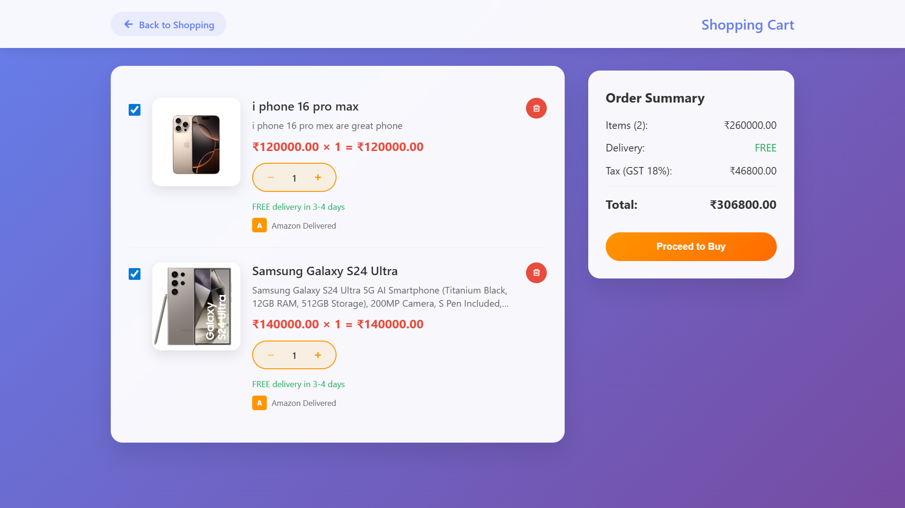
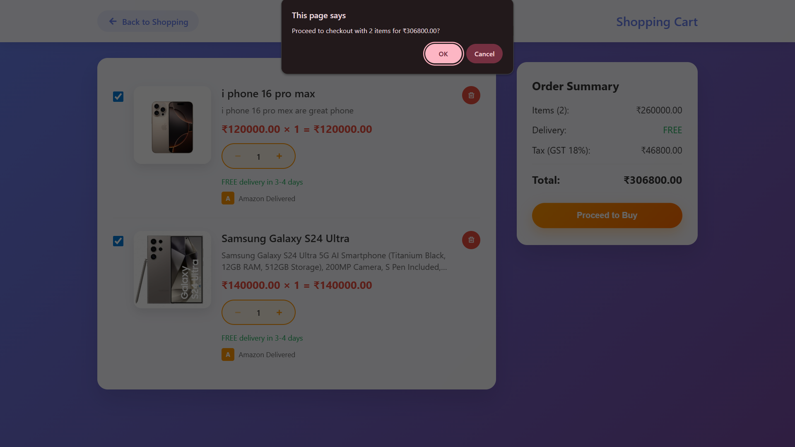
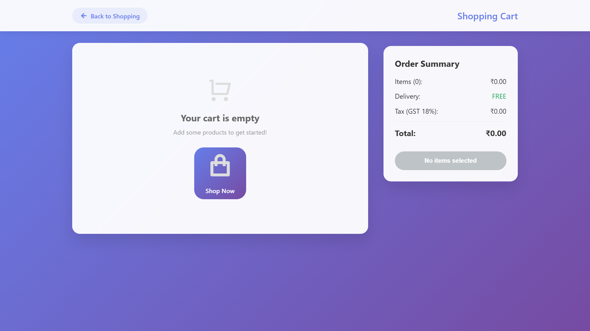

# 🛒 Add to Cart Web Application

## PROJECT INTRODUCTION

Welcome to the **Add to Cart Web Application** 🎉  
This project is a **3-page shopping system** that allows users to **add products, view added items, and manage a shopping cart**.  
The goal of this project was to simulate a real-world **e-commerce cart system** using **Vanilla JavaScript, HTML, and CSS** with **localStorage integration**.  

From product entry to checkout, this app covers the **full cart workflow** in a clean and user-friendly way.  

---

## PROJECT PROFILE

**Note:**  
- This is a **Frontend project** (no backend).  
- Data is stored in **localStorage** for persistence.  
- The app demonstrates **dynamic cart updates, quantity management, and total price calculation**.  

---

## OBJECTIVES OF THE PROJECT

### General Objective
- Build a simple yet functional **e-commerce cart system**  
- Learn and implement **localStorage CRUD operations**  
- Create a **smooth user experience** for shopping workflow  

### Specific Objectives
- Add new products with details (name, price, image)  
- Display added products dynamically  
- Add items to the cart from the product list  
- Show **total items and total price** in the cart  
- Implement **increase/decrease quantity** logic  
- Provide **clear cart and buy item features**  

---

## ENVIRONMENT DESCRIPTION

### Hardware & Software Requirements
- **PC / Laptop** with a modern browser (Chrome, Edge, Firefox)  
- **VS Code** or any text editor  
- Basic knowledge of **HTML, CSS, JavaScript**  

---

## TECHNOLOGY USED

- **HTML5 & CSS3** → Page structure & styling  
- **JavaScript (Vanilla)** → Cart logic, localStorage operations, DOM updates  
- **localStorage** → Persistent storage of items and cart data  

---

## SCREENSHOTS / IMAGE GALLERY

### 1️⃣ Product Management
|  |  |
|:----------------------------------------:|:-------------------------------------:|
| Add New Product Page                      | All Added Products List                |

---

### 2️⃣ Shopping & Adding to Cart
|  |  |
|:-----------------------------------------:|:----------------------------------------------:|
| Shopping / Product Display Page            | Adding Items to the Cart                        |

---

### 3️⃣ Cart Operations
|  |  |  |
|:--------------------------------------:|:-------------------------------:|:-----------------------------------:|
| View Cart with Total Items & Price      | Buy Item Functionality           | Clear Cart Functionality            |

---

## SYSTEM DESIGN / FLOW

**App Flow:**  
1. User adds a product → stored in localStorage  
2. Product list page displays added products dynamically  
3. User clicks **Add to Cart** → product goes to cart page  
4. Cart page shows **item list, quantity, and total price**  
5. User can:  
   - Increase/decrease quantity  
   - Buy items (confirmation shown)  
   - Clear cart (all data reset)  

---

## CHALLENGES FACED
- Handling **localStorage CRUD operations** for products and cart  
- Syncing **quantity updates with total price** in real time  
- Making cart updates **instant and persistent**  
- Designing a clean UI for multiple pages  

---

## FUTURE IMPROVEMENTS
- Add **user authentication & backend database**  
- Integrate a **payment gateway simulation**  
- Enhance UI with animations & product filters  
- Add **search and sorting functionality**  
- Responsive mobile-first design  

---

## CONTACT
- GitHub: @sujal68 https://github.com/sujal68  
- Email: sujalkidecha68@gmail.com 

**Made with ❤️ by Sujal Kidecha**
